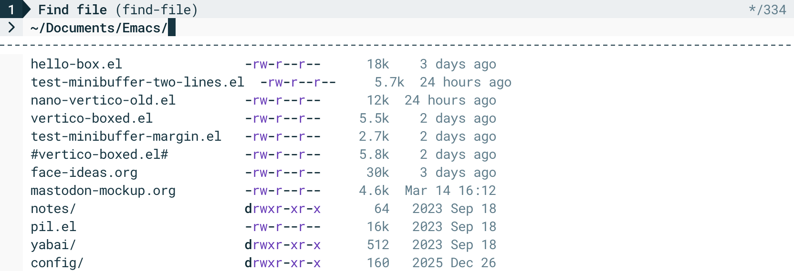

* NANO vertico

This package provides `nano-vertico-mode`, a global minor mode that
reshapes the vertico minibuffer display to match the NANO
aesthetic. Features include a pill-shaped depth indicator, a custom
header showing the originating command, and an optional horizontal
separator.

*Note:* default configuration required nerd font (www.nerdfonts.com). If
not available, replace glyphs in 'nano-vertico-symbols'

** Usage

#+begin_src emacs-lisp
(require 'nano-vertico)
(nano-vertico-mode)
#+end_src

** Screenshot

